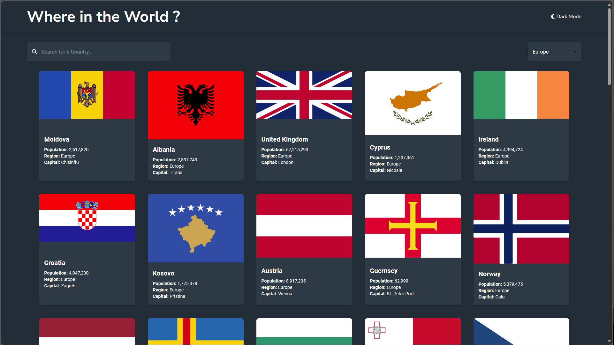

# Frontend Mentor - REST Countries API with color theme switcher solution

This is a solution to the [REST Countries API with color theme switcher challenge on Frontend Mentor](https://www.frontendmentor.io/challenges/rest-countries-api-with-color-theme-switcher-5cacc469fec04111f7b848ca). Frontend Mentor challenges help you improve your coding skills by building realistic projects. 

## Table of contents

- [Overview](#overview)
  - [The challenge](#the-challenge)
  - [Screenshot](#screenshot)
  - [Links](#links)
- [My process](#my-process)
  - [Built with](#built-with)
  - [What I learned](#what-i-learned)
  - [Continued development](#continued-development)
  - [Useful resources](#useful-resources)
- [Author](#author)
- [Acknowledgments](#acknowledgments)

## Overview

### The challenge

Users should be able to:

- See all countries from the API on the homepage
- Search for a country using an `input` field
- Filter countries by region
- Click on a country to see more detailed information on a separate page
- Click through to the border countries on the detail page
- Toggle the color scheme between light and dark mode *(optional)*

### Screenshot

### Links

- Solution URL: [Github Repository](https://github.com/DMK980/Rest-Countries-API)
- Live Site URL: [Live site](https://rest-countries-api-flax-six.vercel.app/)

## My process

### Built with

- Semantic HTML5 markup
- CSS custom properties
- Javascript
- CSS Modules
- [React](https://reactjs.org/) - JS library
- [MUI](https://mui.com/) - Component Library
- [Redux-React](https://react-redux.js.org/) - State management

### What I learned

I learned alot about MUI,Redux,React and working with the API. MUI made it alot easier to make the components
and style them while redux helped alot with state management. The API on the other hand was a pain to work with
since the data is not formatted correctly i should have just used the data provided as that one is much easier 
to work with. 

### Continued development

I want to get better at MUI to be able to make applications faster instead of custom CSS

### Useful resources

- [MUI](https://mui.com/) - Component Library
- [Redux-React](https://react-redux.js.org/) - State management

## Author

- Frontend Mentor - [@DMK980](https://www.frontendmentor.io/profile/DMK980)
- Github - [@DMK980](https://github.com/DMK980)

## Acknowledgments

